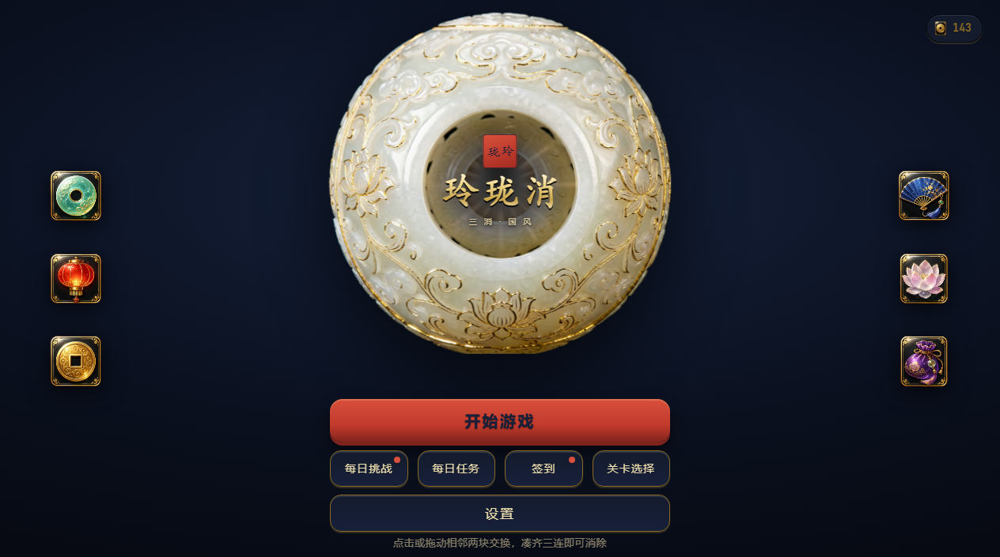
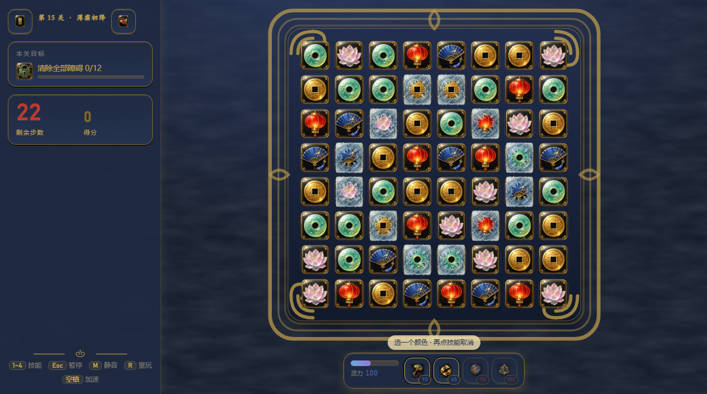
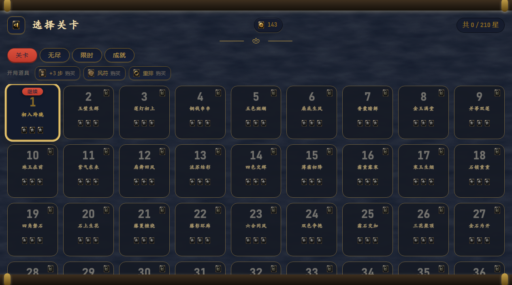
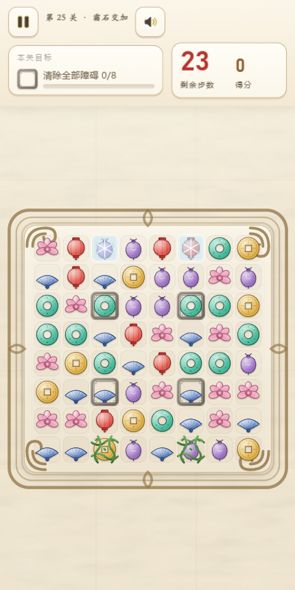
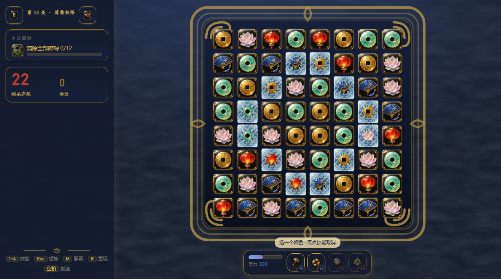
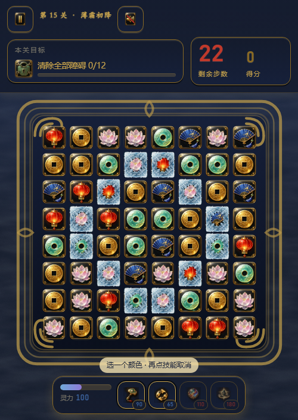
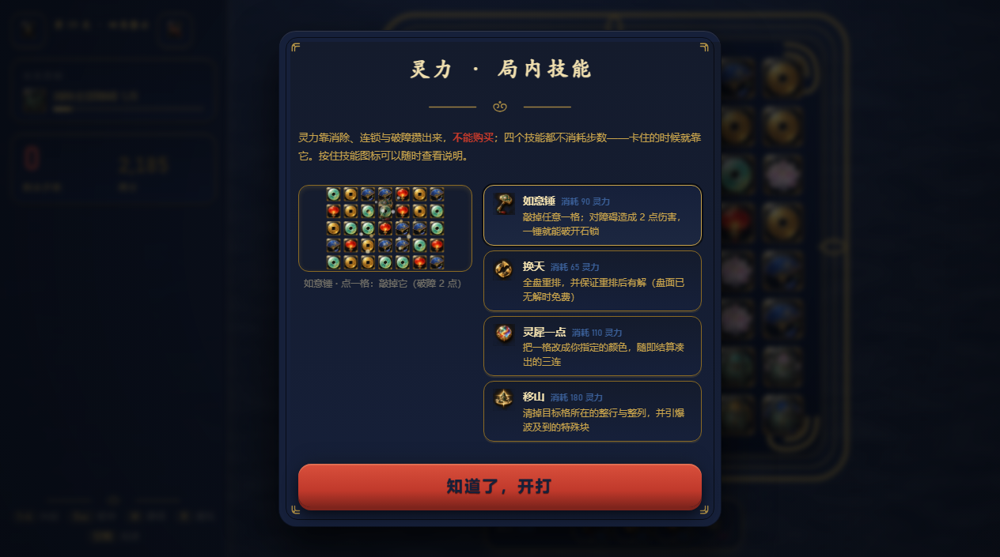
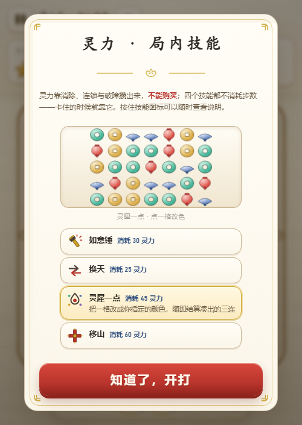
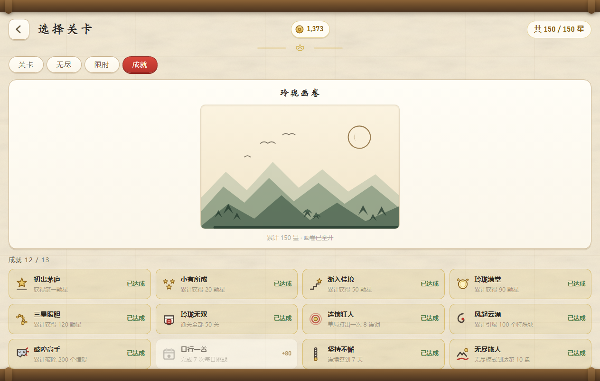
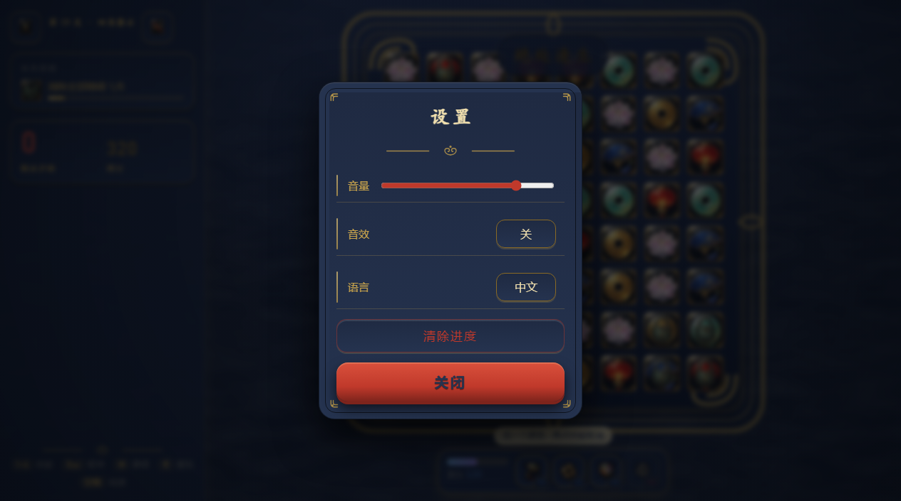

# 玲珑消 · Linglong Match

[](#-技术实现)
[](#-技术实现)
[](#-关卡设计)
[](./lang)
[](#-license)

> 纯原生 Canvas 打造的国风三消。**零依赖、零构建、零外部素材包 —— 双击 `index.html` 即玩，完全离线。**

玉璧、灯笼、铜钱、折扇、莲花、香囊 —— 在玄漆描金的盘面与云纹之间交换相邻两块，
凑齐三连即可消除；连锁、风符、惊雷与太极，会让你在同一张棋盘上反复找到新的解法。
**卡住的时候你也不必干瞪眼**：攒下的灵力可以换成一记如意锤、一次十字爆破、一回全盘重排，
或者把某一格点成你要的颜色。

| 标题 | 对局（清障关） |
|---|---|
|  |  |

| 关卡地图（卷轴） | 手机竖屏 |
|---|---|
|  |  |

| 局内技能（宽屏） | 局内技能（窄屏） |
|---|---|
|  |  |

| 技能说明（宽屏 · 带演示） | 技能说明（窄屏） |
|---|---|
|  |  |

| 成就与画卷 | 设置面板 |
|---|---|
|  |  |

## 🎯 这是个什么游戏

**一句话：用有限的步数，把棋盘上的目标清干净。**

- **核心循环**：点选 / 拖动交换相邻两块 → 凑齐三连消除 → 上方下落补充 → 自动检测连锁，
  连锁层数越高分数倍率越高（最高 ×4）。每关有限定步数，用尽未达标即失败。
- **六种国风块**：玉璧（青绿）· 灯笼（朱红）· 铜钱（金黄）· 折扇（靛蓝）· 莲花（藕粉）· 香囊（紫）。
  每种块的**颜色与轮廓都不同**，色觉障碍玩家也能靠形状分辨。
- **三种特殊块**：
  - **风符**（4 连）：横向 4 连生成横风符（清除整行），竖向 4 连生成竖风符（清除整列）
  - **惊雷**（L / T 形 5 连）：炸开周围 3×3
  - **太极**（直线 5 连）：与任意块交换，清除场上该颜色的全部块
- **组合效果**（两颗特殊块交换即触发）：

  | 组合 | 效果 |
  |---|---|
  | 风 + 风 | 十字清除（整行 + 整列） |
  | 风 + 雷 | 三行 + 三列 |
  | 雷 + 雷 | 5×5 大爆破 |
  | 太极 + 任意块 | 该颜色全部转化并引爆 |
  | 太极 + 太极 | 全屏清除 |

- **三种障碍**：**霜**（消除其上的块即破）· **石锁**（需消除两次，第一次会留下裂纹）·
  **藤蔓**（锁住的块不能交换，重力会在藤蔓处分段——上方的块不会穿过它）。
- **70 关八章递进**：得分 → 收集 → 清障 → 混合 → 双目标 → 收官 → 缠斗 → 无双；
  步数与目标由模拟器反复验证，前四关几乎不会失败，后面几章需要认真规划特殊块与技能时机。
  第五章起每关两个目标，逼你在「清障」和「收集」之间分配步数；第六、八章压到三目标；
  第七、八章换上更密的盘面（藤柱 / 霜簇 / 双垒 / 石十字 / 藤石相间）。
- **局内技能（灵力）**：卡住的时候你能出手，而不是只能眼看盘面烂掉。见下一节。
- **死局自动洗牌**：当棋盘再无可行交换时自动重排（藤蔓块留在原位），保证不会卡死。
- **空闲提示给的是最优解**：5 秒无操作会晃动**当前最优的一步**（不是扫描到的第一个三连——
  实测 200 个随机盘面里，有 82% 的盘面「扫到的第一个走法」并不是最优解）。再过 6.5 秒还没动手，
  会在那一手旁边补一句「为什么推荐它」：能组合爆破 / 能引爆特殊块 / 能打到障碍 / 能消掉本关要收集的颜色 ……
  再卡下去每 7 秒重复一次，不会讲完就永久消失。
  评判标准与平衡模拟器**共用同一份**（`js/hint.js`），所以「提示认为的最优解」和
  「工具认为的最优解」不会各说各话。
- **进度存档与星级**：星级与解锁进度存在本机 localStorage，关卡地图上可随时回看。
- **中英双语**：设置面板一键切换。

## ⚡ 局内技能「灵力」

开局道具要在**知道自己会卡之前**就买好，失败续步是**认输之后**的补救——中间那段「眼睁睁看着盘面
烂掉」的时间，玩家是没有能动性的。灵力就是补这一段：**攒一手，然后在最需要的时候放出去**。

| 技能 | 灵力 | 效果 |
|---|---|---|
| **如意锤** | 90 | 敲掉任意一格，对障碍造成 **2 点**伤害（一锤破开石锁）；若该格是特殊块则引爆 |
| **换天** | 65 | 全盘重排并保证有解；**盘面本来已无解时免费** |
| **灵犀一点** | 110 | 把任意一格变成你指定的颜色，随即按正常规则结算由此产生的三连（所以会自然连锁、自然造特殊块） |
| **移山** | 180 | 以目标格为中心的**整行 + 整列十字爆破**，并链式引爆波及到的特殊块 |

- **四个技能都不消耗步数**——代价只有灵力。这是「攒 → 爆」的情绪闭环。
- **灵力只能玩出来，不能买**（守住下面那条铁律）：每关开局送 100 点，其余靠消除（每块 +1）、
  连锁（每层 +6）、破障（+6）、引爆（+5）、组合（+15）积攒，上限 240。满槽后溢出按 1:2 折算成分数，
  不让你有「不敢花就浪费」的负罪感。
- **价格是量出来的，不是拍的**：一关的灵力总收入约 230~350，所以技能定价在 65~180 这一档，
  一关大约**放 2~3 次**。早先价格是 25~60，等于一关能放 4~5 次大招——实测「无脑砸移山」把
  70 关的平均胜率从 70% 推到 **99.8%**，难度直接消失。
  定价有两条边界，都是量出来的：**太高**（试过 220）玩家整局点不出来，等于没有这个技能；
  **太低**（25~60）无脑刷就能过关。现在每种技能都单独量过「只刷它」的强度
  （`--skills=max:<技能>`）：移山 93.9% · 如意锤 87.1% · 灵犀一点 71.5%。
  灵犀一点明显偏低是因为它是情景技能（收集关 / 凑连锁），刷它本来就没收益，所以给得比另两个宽松。
- **背水一战**：剩余步数 ≤3 时灵力获取翻倍，并提示——把「要输了」的垃圾时间变成大招连放的高光时间。
- **绝处逢生**：步数耗尽、目标未完成时，若灵力 ≥120，可以花 120 灵力换 +3 步继续（每关最多 2 次）。
  **不花金币**，与金币续步并存：灵力不够才轮到金币那条路。失败于是从惩罚变成一次英雄时刻。
  它才是真正的**反流失闸门**——技能被定成稀缺的战术资源之后，保底由它来兜：
  定价 120 = 半槽，只要稍微存过一点就掏得出。
- **操作**：点技能 → 点棋盘选目标（灵犀一点再选颜色）；再点一次技能或按 `Esc` 取消；
  键盘 `1~4` 依次释放。瞄准时合法目标格会高亮，选色环只列本关实际存在的颜色。
- **看得懂才用得上**（技能最容易犯的错不是做得弱，是玩家不知道它是干什么的）：
  - **首次进关自动讲一次**：第一次拿到技能栏时会弹出「灵力 · 局内技能」——左边一个**演示窗口**，
    用真的块精灵循环播放每个技能的实际效果（如意锤砸下→石锁炸开、移山整行整列亮起→清空、
    灵犀一点选色→凑成三连、换天全盘飞散重排），右边四条：图标、名字、消耗、一句话效果；
    外加一段总说明（灵力怎么来、**不能买**、技能不吃步数）。演示会自动轮播，点某一条就停在那个技能上，
    条目高亮与演示同步。关掉才算「看过」（存档 `seen` 标记），中途刷新还能再看到，之后不再打扰。
    教学期间对局被按住（`Game.holdForIntro`）——限时模式不能一边读一边掉时间。
  - **随时按住查看**：鼠标悬停或触屏长按任意技能图标，就在技能栏上方弹出该技能的说明卡。
    触屏没有 hover，长按是手机上唯一的查看入口，所以**松手后卡片再留 2.6 秒**——
    一抬手就消失等于没看；同时长按不会顺手把技能放出去。
  - **出手前先说要发生什么**：进入瞄准态时提示的是「点一格：清空整行整列」这类具体后果，
    而不是笼统的「请选择目标」；进入选色阶段才提示怎么取消。
  - **选色给的是元素图标，不是色块**：灵犀一点第二步的候选一律用块图标本身
    （玉璧 / 灯笼 / 铜钱 / 折扇 / 莲花 / 香囊），每个候选都带 `aria-label` 元素名。
    这游戏本来就靠「颜色 + 轮廓」双重区分（色觉障碍玩家也能只凭形状分辨），
    选色只给一块颜色等于把这套设计丢掉；而且玩家嘴里说的是「莲花那个」，不是「粉色那个」。
    演示窗口里的选色环节同样用图标，飞进格子的也是一整块图标。
    另外选色阶段不再满屏铺「可改色」底纹——格子已经选好，再标一遍只会把已选的那一格埋掉。
  - **暂停面板留了入口**：`技能说明` 按钮可以随时重看那张教学卡。
  - **布局**：宽屏演示在左、条目在右；窄屏改上下排，条目退化成「选择器」——
    四条都保留图标/名字/消耗，但完整说明只留正在演示的那一条（说明与演示同步，不用四处找对应）。
    这样手机上一屏能塞下全部内容，不用滚动。
- **数值验证**（`node tools/balance.cjs --skills --weaken=35 --runs=120`，模拟一个 35% 走法乱下的玩家，
  同一个种子跑两遍做对照）：

  | 关卡 | 无技能胜率 | 用技能后 | 变化 |
  |---|---|---|---|
  | 13 | 47% | 72% | +25pt |
  | 19 | 34% | 71% | +37pt |
  | 23 | 30% | 56% | +26pt |
  | 25 | 47% | 74% | +28pt |
  | 28 | 42% | 60% | +18pt |
  | 29 | 29% | 48% | +18pt |
  | **平均** | **70.9%** | **79.6%** | **+8.7pt** |

  三星率全程基本不变（技能保通关、不送三星），所以「认真规划拿三星」的追求还在。
  偏难的 7 关（19/23/25/27/28/29/30）额外多送 15 点开局灵力（`levels.js` 的 `BOOST_QI`）——
  只加「新系统给多少」，不动 moves / objectives / stars 这些已校准的难度参数。
- **强度闸门**：`node tools/balance.cjs --skills=max[:技能]` 模拟「无脑刷某一种技能」。
  它是这套定价的主要把关口径——**技能不能强到无脑就能过，也不能贵到整局点不出来**。
  重新定价后的实测（同一批种子，70 关；上界模型还会挑最优目标格，比真人更狠，所以这列偏悲观）：

  | 打法 | 无技能 | 用技能 | 说明 |
  |---|---|---|---|
  | 无脑砸移山（上界） | 70.4% | **93.9%** | 定价 25~60 时是 **99.8%**，等于作弊 |
  | 无脑砸如意锤（上界） | 70.1% | 87.1% | 只看移山会漏掉「刷便宜技能」这条路 |
  | 无脑砸灵犀一点（上界） | 70.1% | 71.5% | 情景技能（收集/凑连锁），刷它没收益 |
  | 卡住才用（策略） | 70.4% | 74.2% | 够用，但不是万能 |
  | 会乱下的弱玩家 | 58.1% | 64.3% | +6.2pt、救回 9 关 |

  要再调强度就改 `CFG.QI` 与 `CFG.SKILLS` 的价格，然后把这几种打法都跑一遍复验；
  关卡级还可以用 `skills: { qiStart, qiScale }` 覆写。绝处逢生（+3 步）是独立的反流失闸门，
  不受「会不会刷技能」影响——技能是稀缺的战术资源，保底归它。

## 🔁 留存系统（离线可用的时间锚点）

没有后端、没有推送、没有广告内购，所以只做「本地时间锚点」能支撑的机制：

- **金币经济**：通关按星级产出（1★10 / 2★20 / 3★35），重玩旧关只按 30% 计（防刷），
  每累计 10 星追加 100 金币里程碑，每日产出上限 250（防通胀）。
  铁律：**金币只能买「重试的机会」，不能买「永久的强」**——否则关卡数值验证全部作废。
  局内技能「灵力」同样守这条线：它**只能玩出来、不能买**，且每关清零，不进经济系统。
- **失败续步救援**：失败时若目标完成度 ≥70% 且金币足够，提供「+5 步」继续本局：
  首次 120 金币，同一次挑战内每多买一次加价 60，第 3 次免费赠送。
  完成度不足或买不起时**不推销**——骗人的续步只会换来差评。
- **连续签到**：7 天一个循环，第 7 天奖励约等于常规日的 3 倍（目标梯度）；
  **漏 1 天原地暂停、漏 2 天才重来**（铁律反而赶人）；另有一条永不重置的累计轨道（7 / 30 / 100 天）。
- **每日挑战**：日期字符串经 FNV-1a 哈希成种子，同一天在所有设备上生成**完全相同的盘面**，
  不限尝试次数但只记首通（首通 40 金币，两星以上再 +30）；月历打勾记录本月完成情况。
  难度按星期轮转（周一分数 → 周三收集 → 周五分数+清障 → 周日全清障），
  全部经 `node tools/balance.cjs --daily --days=21` 抽查校准，胜率落在 42%~98% 区间。
- **每日任务 ×3**：按日期种子生成，易/中/难各一且种类互不重复；七类任务（通关 / 星级 /
  不续步通关 / 收集某色 / 破障 / 引爆特殊块 / 打出连锁）全部能在正常通关中顺手完成，
  三条合计 15~25 分钟；每天 1 次免费换牌，单条 20/28/35 金币，全部完成再 +60。
  领取有回执（「任务奖励 +35 金币」），按钮文案跟着状态走：三条都单独领完之后，
  底部按钮改写成「领取全清奖励 +60」——它还叫「一键领取」的话，玩家会以为有任务漏领了
  （这是实际被报出来的问题）。没有可领的东西时按钮直接消失。
- **开局道具**：+3 步（80 金币）· 风符（120）· 重排（60），在关卡地图上点击装填、开局自动生效；
  同类只能带 1 件，满配约 4~5 步——控制在第四章步数的 15%~25%，不让关卡设计失去意义。
  风符固定落在盘心且颜色避开即时三连，落点可预期。
- **无尽模式**：一盘一个目标，达标进入下一盘并结转剩余步数（上限 5 步）；每 3 盘多给 2 步、
  障碍缓慢增加。目标分按颜色**分层线性**增长，实测通过率 100% → 71~87% → 52~70% 平滑下降。
  特意不上 6 色：实测 6 色的得分能力只有 5 色的六成，会让难度在第 9 盘出现断崖。
- **限时挑战**：60 秒内尽可能多得分，不计步数；**连锁动画不吞时间**，按分数给三档金币。
  两种模式都只跟自己的历史比（最佳盘数 / 本周最佳 / 最高分）——没有后端，也不编造真人排行榜。
- **成就与画卷**：13 个成就（星级 / 连锁 / 引爆 / 破障 / 每日 / 连签 / 两种模式纪录）达成即自动发金币；
  累计星数还会逐层点亮一幅五层水墨画卷（门槛按满星上限的比例给：10% / 28% / 52% / 78% / 100%）。
  成就里的星级门槛与「通关全部关卡」同样跟着关卡数走（描述里的数字由 `Achievements.needOf` 注入），
  所以再加关卡时不用改 id、图标或文案键。

## 🎮 快速开始

**方式一（推荐）**：直接双击 `index.html`，浏览器打开即玩（已按 `file://` 直开做过适配与实测）。

**方式二**：起一个本地静态服务器（任选其一）：

```bash
python -m http.server 8901
# 或
npx http-server -p 8901
```

然后访问 `http://127.0.0.1:8901/index.html`。

### 操作

| 操作 | 方式 |
|---|---|
| 交换块 | 点击两块相邻的块，或直接按住拖动一格 |
| 释放技能 | 点技能栏图标（或键盘 `1~4`），再点棋盘选目标；灵犀一点还要选一个颜色 |
| 查看技能说明 | 鼠标悬停技能图标，或触屏长按；也可从暂停面板打开完整说明 |
| 取消技能 | 再点一次该技能，或按 `Esc` |
| 加速动画 | 结算动画进行时点击棋盘任意处（最高 3.2 倍速） |
| 暂停 | 左上角按钮，或键盘 `Esc` / `P` |
| 静音 | `M` |
| 重玩本关 | `R` |
| 加速当前步骤 | `空格` |

## ⚙️ 技术实现

- **零依赖 · 零构建 · 零外部素材包**：全部为经典 `<script>` 顺序加载，**不使用 ES modules、不发起
  `fetch`/`XHR`**——这正是 `file://` 双击直开也能正常工作的原因。图片走 `new Image()` 相对路径，
  音效走 `HTMLAudioElement`（媒体元素不受 `file://` 的 CORS 限制）。
- **Canvas 2D + DOM 混合**：棋盘、粒子、飘字、震屏由 Canvas 绘制；HUD、关卡地图、面板用 DOM，
  二者通过状态对象单向传递。
- **逻辑与表现分离**：`board.js` / `special.js` / `resolver.js` / `skills.js` 不碰任何 DOM，
  可在 Node 下直接加载，因此核心规则可以被自动化测试覆盖；表现层只读取「事件时间轴」做插值回放。
- **一次算完、逐帧回放**：一回合的完整步骤（交换 → 组合爆破 → 匹配 ↔ 下落 → 结束）由解析器
  一次性算完并产出带时长的事件流，UI 按事件播放动画，输入在结算期间被锁定（快速连点不会破坏状态）。
  技能走的是**同一条流水线**（`Resolver.beginSkill` / `beginScan`），所以计分、连锁、任务与成就统计
  全部自动生效，表现层不需要为技能开任何后门。
- **性能**：粒子与飘字走对象池，Canvas 按 devicePixelRatio 缩放，固定步长更新 + 插值渲染。
  实测单帧 `update + draw` 成本 **0.92 ms**（1280×720，满盘精灵与阴影），60fps 余量充足。
- **响应式**：宽屏时信息栏在左侧一列，手机竖屏时自动变为顶部信息条，棋盘始终居中并等比缩放。
  技能栏是棋盘下方的悬浮条，它会把自己的高度通过 `Render.setBottomInset()` 告诉渲染层，
  棋盘据此上移——窄屏、横屏、矮屏都不会压住最后一行。

### 目录结构

```
linglong-match/
├── index.html              # 页面骨架 + 全部 DOM 覆盖层
├── css/                    # base（变量与布局）/ ui（面板与地图）/ anim（界面动画）
├── js/
│   ├── util.js  config.js             # 工具、全局常量与数值表
│   ├── board.js special.js resolver.js skills.js hint.js skilldemo.js
│   │                                  # 纯逻辑：棋盘 / 特殊块 / 回合状态机 / 局内技能与灵力 / 最优走法判定
│   │                                  # skilldemo 是技能说明里的演示动画（自己的 rAF，暂停时也能跑）
│   ├── levels.js daily.js quests.js modes.js achievements.js
│   │                                  # 70 关数据 / 每日挑战 / 每日任务 / 无尽·限时 / 成就·画卷
│   ├── progress.js                    # 存档：星级 / 金币 / 签到 / 任务 / 各模式纪录 / 统计
│   ├── anim.js fx.js                  # 时间轴与粒子 / 技能与特殊块的演出特效
│   ├── render.js                      # Canvas 绘制
│   ├── input.js hud.js ui.js game.js  # 输入 / HUD / 界面流转 / 关卡会话
│   ├── assets.js audio.js i18n.js     # 素材加载 / 音效 / 文案
│   └── main.js                        # 引导与主循环
├── lang/                   # 中文 / English 文案
├── assets/img/             # 59 个素材：方块/特殊块/障碍/技能/UI 小图标是 256px PNG（AI 生成后切图），
│                           #   棋盘框/纸底/远山/云纹/卷轴/成就徽记 仍是矢量 SVG
├── assets/sfx/             # 22 个 WAV 音效
├── tools/                  # 自检、平衡验证、浏览器冒烟、音效体检、素材生成与换色脚本
└── screenshots/
```

## 🧪 开发者工具

```bash
node tools/selftest.cjs --turns=20000   # 逻辑自检：208 项断言 + 两万回合随机模拟
node tools/balance.cjs --runs=200       # 关卡平衡：贪心玩家模拟，输出胜率与星级建议
node tools/balance.cjs --level=20       # 只跑第 20 关
node tools/balance.cjs --from=51 --to=70 # 只跑一批（标定新关卡时用，不必每次跑完 70 关）
node tools/balance.cjs --daily --days=21 # 每日挑战抽查：连看三周的胜率分布，防止出现「靠运气」的日子
node tools/balance.cjs --skills --weaken=35 # 局内技能回归：同一个种子跑两遍（关技能 / 开技能），
                                        # --weaken=35 模拟「35% 走法乱下」的玩家，回答「技能能不能救回卡关的人」
node tools/balance.cjs --skills=max     # 技能收益上界：灵力全砸移山，测难度天花板会不会塌
node tools/browser_test.cjs             # 无头浏览器冒烟：点遍所有按钮 + 图片体检 + 脚本化演练四个技能 + 布局检查
node tools/browser_test.cjs --w=430 --h=800 --shot=out.png
node tools/browser_test.cjs --shot=achievements.png --shot-screen=achievements
                                        # --shot-screen 先切到指定界面再截图；--eval='<js>' 可先注入一段调试脚本
node tools/check_sfx.cjs                # 音效体检：峰值电平是否符合设计、连锁音高是否单调递增
python tools/serve.py                   # 本地开发服务器（禁缓存，改完刷新即生效）
node tools/gen_tiles.mjs                # 重新生成全部 SVG 精灵
python tools/gen_sfx.py                 # 重新合成全部 WAV 音效
python tools/slice_sheet.py <表.png> <输出目录> 名字1,名字2,... --size=256
                                        # 把 AI 生成的素材表切成一个个透明 PNG（纯色底自动抠、可 --open=N 挖掉
                                        #   空心素材中间的洞、自动补成正方形）；方块/技能/UI 图标就是这么来的
python tools/restyle_dark.py --check    # 把矢量外圈（棋盘框/纸底/远山/云纹/卷轴/徽记）换成深色配色；先 --check 看会改哪些
python tools/restyle_css.py --check     # 把样式里的字面色按"色相家族 + 透明度"换肤（面板面/描边/投影/高光）
```

改完特效后：直接打开 `tools/fx_preview.html`（或截一张 `fx_preview.png`），
八个特效的五帧切片会一次画出来——比在对局里撞时机截图靠谱。

- **自检覆盖**：棋盘生成不变量（无初始三连、必有可行走法）· 随机回合模拟（棋盘永远填满、
  回合结束后无残留三连、特殊块与障碍数据合法）· 特殊块生成规则（4 连 / L·T / 5 连）·
  组合效果范围（十字、5×5、三行三列、同色全消、全屏）· 障碍分层与藤蔓重力分段 ·
  死局洗牌必定产出可玩棋盘 · 70 关数据合法性（含「收集目标颜色必须在该关色池内」这类容易写错的检查）·
  局内技能（四个技能的计划与落点、灵力收支与溢出、背水一战倍率、绝处逢生门槛与次数、
  技能资产与中英文案齐全、**技能回合带出连锁不崩**）·
  空闲提示（`Hint.best` 与暴力取最大一致、同盘面结果稳定、有两颗特殊块时推荐组合、
  有太极时推荐太极、理由取最大项、理由文案中英齐全）·
  **素材完整性**（源码里写死的键 / 配表声明的图标 / 磁盘文件，三方对账，并反向查「生成了却没人用的孤儿图」）·
  **弹层叠放次序**（每个弹层都要在 z-index 梯子上占一格，并校验「确认框最高」「技能说明高于暂停」这类关系）·
  **文案完整性**（源码里写死的 `I18N.t('key')`、拼接键（技能/成就/道具/任务种类）、`index.html` 的
  `data-i18n` 属性，三类来源都对着中英词典核一遍，并检查中英键数一致——
  缺键不会报错，只会静静地把键名本身显示给玩家）。
- **平衡验证**：用一个会优先照顾目标、破障与特殊块的贪心玩家跑满每关若干局，
  输出胜率、平均剩余步数与得分分位数，并给出二星 / 三星阈值建议。当前 70 关的胜率曲线为：
  第一章 ~100%（教学）→ 第二章 71–100% → 第三章 49–99% → 第四章 33–77% →
  第五~六章 46–83% → 第七~八章 44–84%。
  加了 `--skills` 之后，同一个种子会跑两遍做对照，逐关给出「技能前后」的胜率与三星率变化。
- **浏览器冒烟**：内置 http 服务 + Chrome DevTools Protocol（Node 22+ 自带 WebSocket，
  不引入 puppeteer）。它会把每个界面上的按钮都点一遍收集报错，做图片体检，
  **按真实节奏**分步演练四个技能（每步之间等动画收束，因为 `canInput()` 在结算期间会挡住第二次技能），
  用真实指针与**真实触摸事件**验证新手教学只弹一次、长按出说明卡且不误放技能、短按正常出手，
  **用像素级采样确认演示窗口真的在画**（canvas 存在不等于有内容——这里抓到过一次「帧循环在跑但 ctx 是空的」），
  并检查教学面板在一屏内放得下、技能栏没有压住棋盘最后一行——宽屏 / 窄屏 / 矮屏三种尺寸。

### 调试参数

| 参数 | 作用 |
|---|---|
| `index.html?debug=1` | 左上角显示 FPS、粒子数、当前步骤与状态 |
| `index.html?level=15` | 直接进入第 15 关（调试与分享用） |
| `index.html?screen=map` | 直接打开关卡地图（调试与截图用） |
| `index.html?screen=settings` | 直接打开设置面板 |

## 🎨 界面设计

界面不追求堆砌国风元素，而是把「玄漆 + 描金 + 朱砂」按 60/30/10 的比例落到每个元件上
（方块与技能图标是 AI 生成的写实材质，其余全是自绘）：

- **字体分三栈**（这是「文字不好看」的最大症结）：正文与按钮用黑体栈
  （PingFang SC / Microsoft YaHei UI / Segoe UI），标题与印章用楷体栈（Kaiti SC / STKaiti / KaiTi，
  只在 ≥24px 使用——小字号楷体笔画细、发虚），**所有数字用拉丁字体优先**
  （Bahnschrift / DIN Alternate / Avenir Next），并开启 `tabular-nums`，分数跳动时不会左右抖。
- **字号按 1.5 倍跳跃建立层级**：标题 74 / 面板标题 27 / 主数值 42 / 分数 27 / 正文 15 / 标签 11 px，
  每屏只有一个「最大数字」。
- **立体感 = 三层**：硬边下压（`0 4px 0 暗色`）+ 柔和环境影 + 内高光；按钮按下时下沉 3px 且硬边收窄，
  这是廉价感与「糖块感」的分界线。
- **面板**用外层木色描边 + 内缩 8px 的描金细线 + 四角云纹小饰，嵌套关系靠线而不是靠重阴影。
- **文字对比度**：正文 `#F0DFAE` on `#0B1120`（12:1），金色只用于装饰与大字（金色小字对比度不足 2:1，禁用）。
- **状态有明确三态**：当前关 = 金边 + 呼吸动画 + 「继续」角标；已通关 = 漆底金星；未解锁 = 去饱和 + 去投影。
- **弹层必须有明确的层级**：所有 `.overlay` 用同一个 z-index，所以**靠 DOM 顺序排列层叠是不可靠的**。
  能叠在别的弹层上面的（暂停 55 / 结算 56 / 续步·绝处逢生 57 / 设置 58 / 技能说明 59 / 加载 60 /
  确认框 70）都要在 `css/ui.css` 的梯子上显式占一格。技能说明比暂停高，因为它就是从暂停面板里打开的；
  确认框永远最高，因为任何面板都可能弹它。自检第 11 节会拦住「忘了排级」的新弹层。
- emoji 图标（❖ / 🔊）全部换成自绘 SVG，跨平台风格统一。
- **首页主视觉：白玉描金玲珑球**。玲珑球（鬼工球）就是游戏名字本身 —— 一颗镂空多层青/白玉球，
  层层相套、纹路描金。球心那个镂空圆窗正好留给标题：名字是从球里透出来的，不是压在背景上。
  两侧站六个宝贝（玉璧 / 灯笼 / 铜钱 / 折扇 / 莲花 / 香囊），窄屏收起。
  > 素材来自 AI 生成后手工修：球心的爆亮要压暗（原图中间一束强光，整颗球读起来像一只眼睛）、
  > 底部的圈足要裁掉（不裁就像个碗）、圆窗留白给标题。
- **深色主题的两条坑**（都是换成漆底后实际踩出来的）：遮罩层不能用浅色蒙版——它会把深底"提亮"成米白，
  弹窗看着像糊了张纸；障碍覆盖层要么是空心的环（霜、藤蔓），要么像石锁那样缩到 0.8 格——
  障碍底下的方块仍要参与配对，颜色被盖住就没法玩了。

## ✨ 特效设计

技能与特殊块的演出在 `js/fx.js`：`Anim.burst` 管"一炸就散"的碎屑，
这里管**有节奏的分阶段演出**（如意锤是"锤影落下 → 白闪裂纹 → 冲击环 + 石屑 → 余烬"四段，
太极是"法阵展开 → 吸色 → 墨瀑 → 淡金"四段），时长与震屏参数集中在 `CFG.FX`。

- **两类节奏分开**：打击类（如意锤 / 移山 / 惊雷）走"白闪 + 冲击环 + 震屏"（震屏 6 / 10 / 14px）；
  变化类（换天 / 灵犀一点 / 太极）走"墨影旋流 + 金环收束"、**不震屏**——
  两类混在一起时连放两个技能，画面会晃得看不清盘面。
- **特效只画在棋盘图层内**，且必须在时长内收干净（太极的法阵末段会淡出，否则连用两次会叠影）。
- 连锁不再用横幅文字，改成朱砂金印砸下来；文案由调用方从 `I18N.t('cascade')` 传入，
  特效层不写死中文（英文界面会露馅）。
- **`tools/fx_preview.html`**：直接加载 `js/fx.js` 把八个特效各画五帧成一张图，
  改完特效跑一次就知道有没有画坏——不用靠"在对局里等 300ms 截图"碰运气（那个截到哪一帧全看时序）。
- **技能说明面板**（暂停 → 技能说明）里的迷你演示也调同一套函数，两边不会各走各的。
  两处只取"后半段"：灵犀一点的飞入光点、换天的化墨黑罩会盖住演示真正要讲的东西
  （整块图标飞向目标格、每块沿弧线飞位），所以从金环/绽墨那一段接。

## 🔊 音效设计

18 个音效全部由 `tools/gen_sfx.py` 用 Python 标准库合成（**不依赖 numpy**），
按公开的钟体分音表与混响常量来配参数：

- **金属体 = 敲击瞬态 + 非谐分音 + 拍频**：起音叠 3.5–6.5 kHz 带通噪声（约 2.5 ms）——
  没有这个瞬态，纯正弦叠加听起来像电子琴；每个分音复制两份并各偏移约 ±2 音分，
  产生 2–5 Hz 的拍频，这是「悦耳」的隐藏开关。
- **连锁音高阶梯**：`match1`–`match7` 是 **7 个独立的音高文件**（A 五声音阶上行 880 → 2093 Hz），
  而不是靠 `playbackRate` 变速——变速会同时缩短衰减并改变音色重心。
  第 7 层封顶，避免超过 2 kHz 后变尖。`tools/check_sfx.cjs` 会验证这条阶梯确实单调递增。
- **共享一套 Freeverb 式混响**（8 梳状 + 4 全通，反馈系数由 RT60 反推）：
  消除音 RT60 0.45s / 湿 15%，锣与胜利 1.2s / 湿 30%，UI 与无效音近乎全干。
- **无效操作音**（`invalid.wav`）是「闷、短、下行」：220 Hz 木梆闷击 + 900 Hz 低通 + −2 半音下滑，
  −14 dBFS，与有效操作的「亮、上行」形成对比，且不刺耳。
- **峰值电平分开设定**：消除 −6 / UI −12~−13 / 无效 −14 / 胜利 −3 dBFS，写文件前再做一次真峰值保护（≤ −1 dBFS）。
- **声道**：消除与 UI 单声道（连锁时会同时叠 4–6 个，立体声会互相抵消相位），
  折扇、惊雷、太极、胜负这类氛围音用立体声（左右混响起点错开）。
- **可复现**：生成器使用脚本内置的确定性随机源（xorshift32）而非 `random` 模块或用系统熵——
  同样的参数重跑必然得到逐字节相同的 WAV（已实测校验），仓库不会因为重新生成而出现无意义的二进制差异。

## 📦 素材

**不含任何第三方素材，无版权风险**（AI 生成的部分也是本项目自有，未使用他人作品当参考图）：

- **写实材质（AI 生成 → 切图，PNG 256px）**：六种方块、三种特殊块（风符/惊雷/太极）、
  三种障碍的盘面覆盖层与整块牌两个版本、四个技能图标、星/币/锁/暂停/音效/静音/返回/勋章/三种道具等 UI 小图标。
  生成用的是同一套 prompt + 同一张参考图，保证描边、光源、材质一致；成品由 `tools/slice_sheet.py`
  切图（纯黑底泛洪抠透明、空心素材挖中间洞、每个图标补成正方形再缩到 256px）。
- **矢量外圈（自绘 SVG）**：棋盘框、纸底、水墨远山、云纹分割线、面板四角饰、五级卷轴、13 个成就徽记。
  统一 `viewBox`、统一光源与描边宽度。
- **22 个 WAV 音效**（2.1 MB）：见上一节。

> 换配色时：矢量外圈跑 `tools/restyle_dark.py`，样式跑 `tools/restyle_css.py`（都支持 `--check` 先看改动）；
> 想重做某个方块，就用同一套 prompt 重新生成一张表、再跑切图脚本。
> 素材缺失时渲染层会自动降级为程序化图形，不会白屏。

## 🗺️ 关卡设计

| 章节 | 关卡 | 主题 | 说明 |
|---|---|---|---|
| 一 · 得分 | 1–6 | 熟悉规则 | 4→5 色，目标仅为分数，步数宽裕 |
| 二 · 收集 | 7–14 | 定向消除 | 单色 / 双色收集，开始需要留意盘面颜色分布 |
| 三 · 清障 | 15–22 | 障碍登场 | 霜 → 石锁 → 藤蔓依次引入，清障与得分混合 |
| 四 · 混合 | 23–30 | 6 色多目标 | 6 色、双目标、步数收紧 |
| 五 · 双目标 | 31–40 | 步数分配 | 每关两个目标，清障与收集互相抢步数；引入藤格 / 石带 / 藤墙 / 霜藤交错 |
| 六 · 收官 | 41–50 | 三目标与极限盘面 | 三目标登场，银钩 / 铁壁两张新盘面，步数放宽到 30+ 但目标更硬 |
| 七 · 缠斗 | 51–60 | 障碍加量 | 藤柱 / 霜簇 / 双垒 / 藤石相间，两个目标同时施压 |
| 八 · 无双 | 61–70 | 三目标成为常态 | 石十字等密盘面，终关「天外有天」为分数 + 收集 + 清障 |

每关的 `moves`、目标值与二 / 三星分数阈值都经过 `tools/balance.cjs` 模拟验证。
标定新关卡时用 `--from/--to` 只跑一批，把工具给出的「建议二星/三星」回填即可。

**星级阈值的口径**：它由 `tools/balance.cjs` 按胜局的得分分位数（P50 / P80）给出，属于**软目标**；
  真正的硬门槛是每关胜率落在 35%~100%。改过 `hint.js` 的打分口径之后，阈值相对旧模型平均漂移 −1.4%
  （25 关超过 5%），整体偏向「更容易拿三星」，需要收紧时重跑一次把建议值回填即可。

**摆障碍的两条实测经验**（写在这里以免下次再踩）：

- **按「打击次数」估难度，不是按格数**：石锁要打 2 次、霜和藤蔓 1 次。
  第一版终关摆了 12 个石锁（= 24 次打击），实测胜率 1.3%。
- **成簇比摊开好打得多**：一次三连能同时啃掉挨在一起的好几个，散在四个角则各要一次独立三连。
  同样 8 个石锁，摊在四角胜率 29%，改成两座 2×2 石垒后回到 60%。

## 🚧 后续可做

- 障碍扩展：会蔓延的藤蔓、需要特定颜色破除的封印
- 关卡目标扩展：护送掉落物到底部、限定时间内连击数
- 背景音乐（可用 `gen_sfx.py` 的五声音阶琶音扩展成循环段落）
- 若需要外链分享，可在 `?level=N` 深链基础上加成绩参数

---

## License

[MIT](./LICENSE) © 2026 Linglong Match contributors

素材与代码均为本项目自产：SVG 精灵与 WAV 音效由仓库内的脚本生成，不含任何第三方素材。
